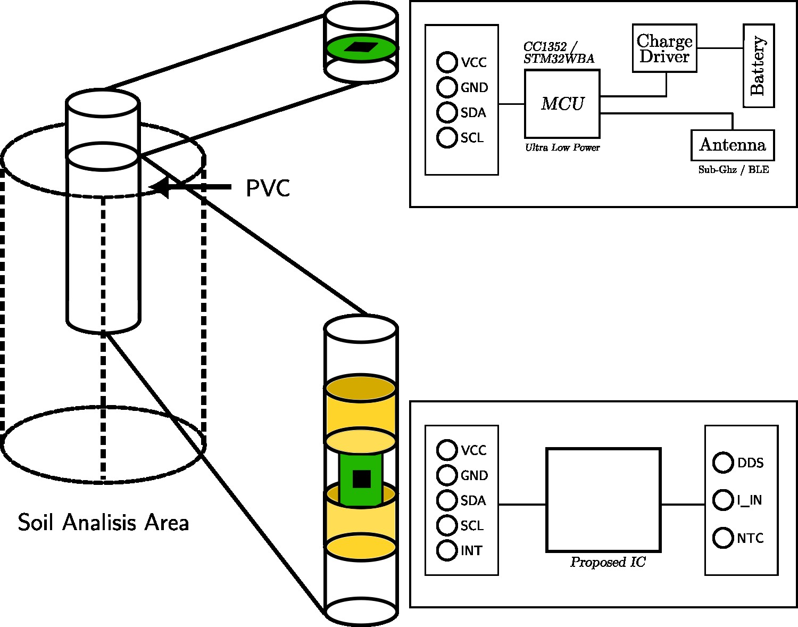
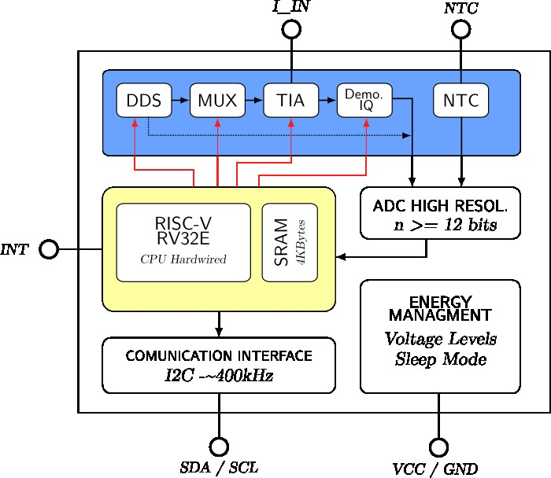

# Y-AllpaSense — Intelligent Soil Parameter Sensor

Universidad Nacional Mayor de San Marcos  
Faculty of Electronic and Electrical Engineering  
Ychma Technologies

---

## About the Team

This project is a collaboration between a graduate engineer and the Advanced Technology Research Group at UNMSM's Faculty of Electronic and Electrical Engineering (FIEE).

The project is led by Bryan Claudio Huane Rodriguez, a systems and embedded electronics engineer with hands-on experience developing PCBs for monitoring equipment in mining operations. His exposure to open-source IC design tools came through participation in IEEE CAS initiatives, particularly the UNICASS program, which opened the path toward exploring custom silicon as a viable approach for real engineering problems. The broader goal behind this work is to build a unique sensor that can work as a standalone device or as part of a larger system developed under Ychma Technologies, a startup currently in its forming stages, focused on embedded systems and precision agriculture technology.

The university side brings the research infrastructure and academic expertise of the FIEE Advanced Technology Research Group, making this a collaboration between industry-oriented development and applied academic research. Beyond the product itself, this project aims to strengthen the group's work in applied research around custom integrated circuits, contributing to a line of investigation that addresses real engineering challenges in Peru.

---

## Product Overview

Y-AllpaSense is a low-cost soil monitoring probe designed for Peruvian farmers who need reliable field data without expensive equipment. The device measures soil parameters: volumetric water content, salinity, and electrical conductivity using electrical impedance spectroscopy (EIS), a technique that extracts physical patterns from the soil by analyzing how it responds to electrical signals across a wide range of frequencies.

The goal is to make this kind of measurement accessible and easy to integrate with modern agricultural monitoring and control systems, whether that's a LoRaWAN network, a datalogger, or a proprietary WSN. The device runs primarily on a 1 W solar panel, which combined with its low power design keeps it running indefinitely in the field with no need for frequent battery changes. For configuration and direct field readout, the node also exposes a BLE 5.x profile readable from any smartphone or tablet within 10 to 30 meters.

For wider network deployments, the node includes a Sub-GHz radio module. While LoRa / LoRaWAN is the default option for open field coverage, the Sub-GHz interface is not locked to that protocol, it can support other RF stacks used in closed or infrastructure-managed environments including solutions based on TI or STM32 wireless platforms.

The system is built around three main components. The first PCB handles battery charging from the solar panel and RF communication. The second board carries the YSM1R IC, which drives the electrodes, captures the soil's electrical response, and outputs already-interpreted data at the lowest possible energy cost. The electrodes themselves are copper or brass rings mounted concentrically on cylindrical PVC sleeves — the PVC protects the electrode and acts as a known reference dielectric in the measurement model. The electric field penetrates radially from the rings into the soil. The volumetric water content and electrical conductivity of the soil within that volume change the complex impedance of the capacitor, and that change is what the YSM1R captures and processes through the full analog chain — TIA, IQ demodulator, and high-resolution ADC — before the RISC-V core fits the Cole-Cole model and outputs the final parameters.

---

## Integrated Circuit Description

The YSM1R is the core of the system. It's not a generic impedance meter adapted for soil use but an agronomic sensor with embedded dielectric spectroscopy, built specifically to extract soil parameters without needing any external processing.

The measurement principle is **electrical impedance spectroscopy (EIS)**. The chip drives the electrodes with a signal that sweeps over 5 frequency decades (1 kHz to 100 MHz), measures the in-phase and quadrature response at each point, and fits a Cole-Cole model to the resulting spectrum. From that fit it directly outputs VWC (%), EC (dS/m), and temperature — ready to transmit.

Each physical phenomenon in the soil has its signature in a specific frequency range. At low frequencies (1–10 kHz), ionic conduction dominates and reveals salinity. In the mid range (10 kHz–10 MHz), polarization and Maxwell-Wagner effects show up and carry information about texture and clay content. At high frequencies (10–100 MHz), free water relaxation is the main mechanism and gives a precise reading of volumetric water content.

Internally, the analog front end is built around a DDS that generates the excitation signal, followed by a MUX that selects the active electrode level, a transimpedance amplifier (TIA) with automatic gain switching, and an IQ demodulator that extracts the in-phase and quadrature components of the response. The NTC thermistor input is handled by a dedicated analog conditioning block at this same stage. Digitization is handled by a high-resolution ADC whose output feeds directly into the digital processing block. For the digital side, the design uses a RISC-V RV32E hardwired CPU paired with 4 kB of SRAM. This will initially operate from an established architecture as a working baseline, with simplification toward a minimal application-specific core as the design matures. Existing open-source SRAM and ROM blocks will be used as a starting point, with no marketplace IP required at this stage.

The IC also integrates an energy management block that handles internal voltage levels and sleep mode, keeping the chip under 1 µA when idle.

Temperature is measured with an external NTC thermistor connected to the IC through a dedicated analog input. It's a standard, low-cost component that's easy to replace in the field. 

The output interface is I²C  (SDA/SCL), implemented via IP of Chipfoundry, keeping integration straightforward with microcontrollers and wireless modules on the system's main board. The chip also exposes an INT pin for interrupt-driven operation, allowing the host to be notified when a measurement cycle is complete without polling the bus.

---

## Mechanical Description

The probe body is a cylindrical high-dielectric-strength PVC tube designed to be inserted vertically into the soil. The PVC serves two purposes: it's the structural element and also the reference dielectric in the measurement model, since its permittivity is constant and well-known.

The top end of the tube houses the communication electronics (BLE and Sub-GHz module), the central power management, and the solar panel connector. Each measurement level has its own PCB sitting inside the tube, stacked along the vertical axis, with electrical connections to the outer rings through sealed holes in the tube wall. Each of these boards carries the YSM1R IC and the NTC thermistor connector one complete measurement node per depth level.

The probe is designed to grow with the application. Additional sensing modules can be stacked to reach deeper soil layers, each one adding a new measurement level to the profile. This means the same hardware architecture scales from a shallow two-level install to a full multi-depth deployment, without redesigning any existing part of the system.

| Level | Typical depth | Parameters measured |
|---|---|---|
| Level 1 | 0 – 15 cm | VWC, EC — shallow root zone |
| Level 2 | 15 – 30 cm | VWC, EC — active root zone |
| Level 3 | 30 – 60 cm | VWC, EC — wetting front |
| Level N | configurable | expandable depending on crop and depth |

---

*Universidad Nacional Mayor de San Marcos — Ciudad Universitaria, Lima, Peru*  
*Faculty of Electronic and Electrical Engineering*
*Ychsma Technologies*
